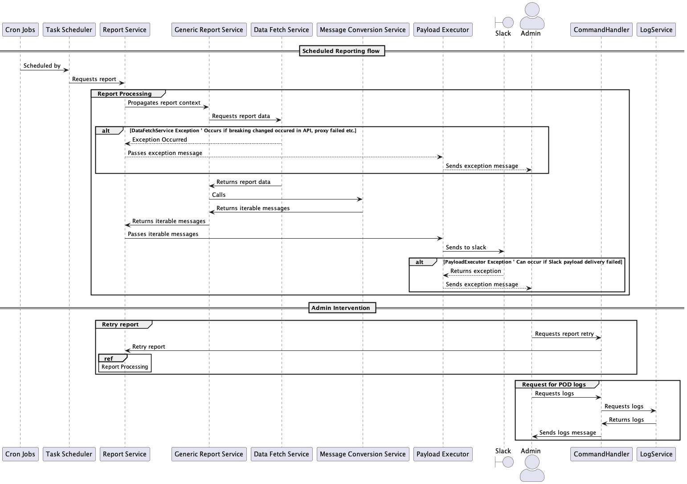

# Notifier 
#### ...with Telegram Admin panel


[](https://codecov.io/gh/whiskels/NotifierBot)
[](https://www.codacy.com/gh/whiskels/TelegramNotifierBot/dashboard?utm_source=github.com&amp;utm_medium=referral&amp;utm_content=whiskels/TelegramNotifierBot&amp;utm_campaign=Badge_Grade)
[](https://hits.seeyoufarm.com)
[](https://snyk.io/test/github/whiskels/telegramnotifierbot)

___
## Trivia
Employees of the company perform some routine tasks on the daily basis. The business need for this application is to be able to have something that can automate these routine tasks and prepare reports that are sent to Slack on a daily basis.

These reports are gathered from internal systems as well as Google Sheets.

Telegram admin panel is added to provide easy access to logs or to retry report generation in case of exceptions.

Initially it was supposed to be a Telegram-only bot with role-based access, but over time end users decided to switch to Slack, which is why Telegram authorization was replaced with a simple chat id check.

## Stack
Java 21, Spring Boot, Feign, AOP, Postgres, Testcontainers, Flyway and a bunch of APIs (Slack, Telegram, Google Sheets).
### Heroku-specific tools
- Papertrail - provides service logs
- Fixie - provides static IP address to access internal systems

### Out of scope
- Caching - reports are served once a day and on Heroku services are restarted each 24 hours, so caching doesn't add any value

## Local run
You can play with the app on your machine if you'd like to.
There is a mock profile you can use for that

Firstly build the JAR file using Java 21

```console
mvn package -DskipTests=true
```

Then run docker-compose with environment variables
```console
TELEGRAM_BOT_TOKEN=${YOUR_TOKEN} \                                     
TELEGRAM_BOT_ADMIN=${YOUR_TELEGRAM_ID}  \
SLACK_WEBHOOK=${SLACK_WEBHOOK} \
docker-compose up
```

Or if you don't want to use telegram:

Adjust application-mock with report.parameters.schedule to send reports to slack
Adjust SPRING_PROFILES_ACTIVE in docker-compose to "mock" and run docker-compose with your webhook

```console
SLACK_WEBHOOK=${SLACK_WEBHOOK} \
docker-compose up
```

## Flow


### Initialization

- Cron Jobs: These are created from report context (cron, type) provided by configs
- Task Scheduler schedules report execution

### Report Processing

- Report Service:
  - The Report Service propagates the report context to the Generic Report Service.

- Generic Report Service:
  - Requests report data from the Data Fetch Service.
  - If there's an exception in the Data Fetch Service, the Generic Report Service informs the Report Service, which then sends an exception message to the admin via the Messaging Service.
  - On successful data fetch, the Generic Report Service sends this data to the Message Conversion Service.
  - The Message Conversion Service returns an iterable set of messages back to the Generic Report Service.
  - Finally, the Generic Report Service sends this iterable set of messages back to the Report Service.

- Payload Executor:
  - The Report Service passes the iterable messages to the Executor.
  - The Executor then sends these messages to Slack.
  - If Slack returns an exception, the Executor Service sends an exception message to the admin.

### Admin Intervention

If exceptions arise during the report processing:

- Retry Report:
  - The admin can ask the Command Handler to retry the report.
  - The Command Handler will request the Report Service to retry the report, repeating the report processing flow.

- Request pod logs:
  - The admin can also ask the Command Handler for the logs.
  - The Command Handler requests these logs from the Log Service.
  - The Log Service returns the logs to the Command Handler.
  - The Command Handler then sends the logs message to the Messaging Service, which sends the logs message to the admin.

### Deployment
Deployment using Maven plugin:

<code>mvn clean heroku:deploy</code>

Starting up:

<code>heroku ps:scale worker=1 -a *app_name*</code>
worker type is required, so application is not scaled down to 0 instances after idle time

Retrieving logs using Heroku CLI:

<code>heroku logs -a *app_name*</code>
